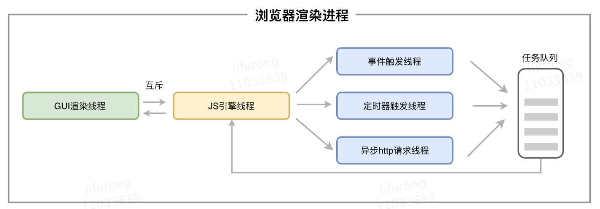
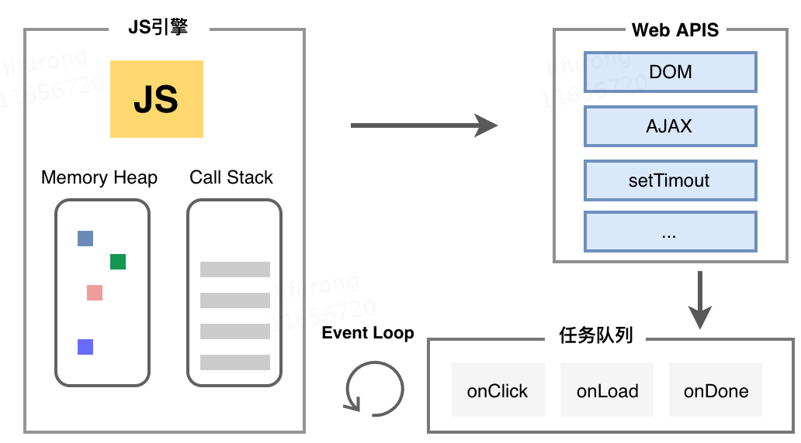
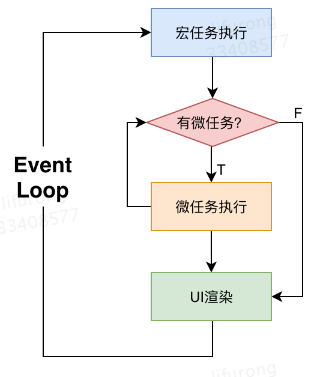
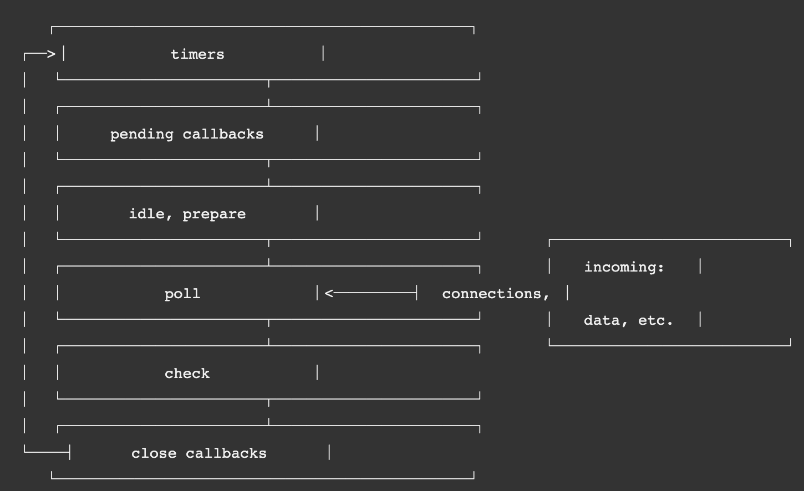
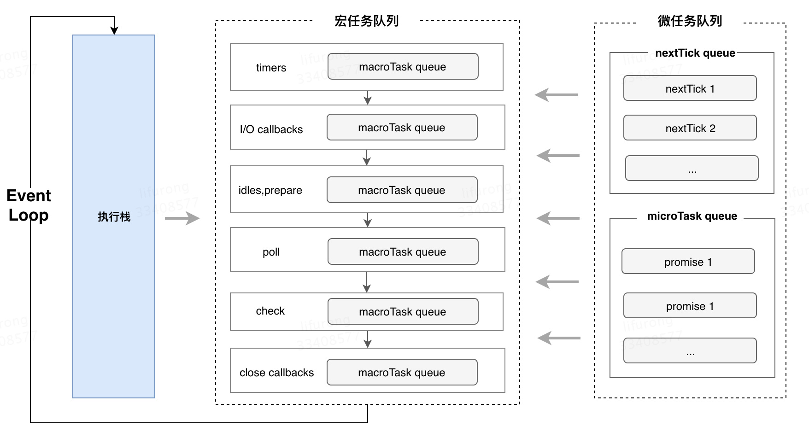

### 浏览器的事件循环

---

代码执行可视化工具：http://latentflip.com/loupe

##### 为什么有事件循环?

javascript 的一个特点就是**单线程**，但是很多时候我们仍然需要在不同的时间去执行不同的任务，例如给元素添加点击事件，设置一个定时器，或者发起 Ajax 请求。因此需要一个异步机制来达到这样的目的，事件循环机制也因此而来。

1. 进程和线程概念
   进程和线程是计算机操作系统中最基本的两个概念。

   - 进程：cpu 资源分配的最小单位
   - 线程：cpu 调度的最小单位
     系统会为每个进程分配独立的内存，进程由单个或多个线程组成。
     可以形象的将进程比作工厂，内存比作每个工厂拥有的资源，线程比作工厂里的工人。每个工厂中会有一个或者若干个工人来协作完成某个任务。每个工厂相互独立，但同一个工厂之间的工人共享资源。

2. 浏览器的多进程

   - 浏览器进程。主要负责界面显示、用户交互、子进程管理，同时提供存储等功能。
   - 渲染进程。核心任务是将 HTML、CSS 和 JavaScript 转换为用户可以与之交互的网页，排版引擎 Blink 和 JavaScript 引擎 V8 都是运行在该进程中，默认情况下，Chrome 会为每个 Tab 标签创建一个渲染进程。出于安全考虑，渲染进程都是运行在沙箱模式下。
   - GPU 进程。其实，Chrome 刚开始发布的时候是没有 GPU 进程的。而 GPU 的使用初衷是为了实现 3D CSS 的效果，只是随后网页、Chrome 的 UI 界面都选择采用 GPU 来绘制，这使得 GPU 成为浏览器普遍的需求。最后，Chrome 在其多进程架构上也引入了 GPU 进程。
   - 网络进程。主要负责页面的网络资源加载，之前是作为一个模块运行在浏览器进程里面的，直至最近才独立出来，成为一个单独的进程。
   - 插件进程。主要是负责插件的运行，因插件易崩溃，所以需要通过插件进程来隔离，以保证插件进程崩溃不会对浏览器和页面造成影响。

3. 为什么 JS 是单线程的？
   
   浏览器渲染进程中有多个线程协作完成任务，主要包括：

   - GUI 渲染线程：负责解析 HTML、CSS，构建 DOM 树和渲染树，然后布局和绘制页面
   - JS 引擎线程：负责解析和执行 Javascript 脚本
   - 事件触发线程：当有事件（AJAX、DOM 事件等）符合条件并触发时，该线程时会将事件放到任务队列中等待执行
   - 定时器触发线程：处理 setInterval 与 setTimeout，在一定时间后将事件放到任务队列中等待执行
   - 异步 http 请求线程：XMLHttpRequest 连接后是通过浏览器新开一个线程请求，将检测到状态变更时，如果设置有回调函数，异步线程就产生状态变更事件放到任务队列中等待执行

   其中，负责执行 JavaScript 的 JS 引擎是单线程执行的。这是因为，JavaScript 作为浏览器的脚本语言，主要作用是处理用户的交互行为，操作 DOM 树和渲染树。假如 JavaScript 是多线程，DOM 操作很容易造成冲突。例如，当一个页面中存在两个线程同时操作一个 DOM 节点，一个负责删除，另外一个负责修改，浏览器应该以哪个线程为准呢？当然这个问题可以通过一些方法来解决，但是为了避免复杂性，JavaScript 在最初设计时就选择了单线程执行。

##### 浏览器的事件循环

1. JavaScript 引擎由两部分组成：

   - Memory Heap（内存堆）：内存分配地址的地方
   - Call Stack（执行栈）：代码执行的地方

2. JavaScript 中的任务分为：

   - 同步任务：在主线程上排队执行的任务，只有前一个任务执行完毕，才能执行后一个任务
   - 异步任务：“任务队列”排队的任务，当异步任务有了结果，会在任务队列中放置事件

   

   如上图所示，在 JS 引擎解析并运行 JavaScript 脚本时，主线程会依次执行栈中的同步任务，同步任务调用浏览器提供的 Web API（DOM、AJAX、setTimeout 等），会在任务队列中放置各种事件（onclick、onLoad、onDone），当执行栈清空（所有同步任务执行完毕）时，会去任务队列中读取可执行的事件并放到执行栈中执行。该过程不断重复，这种机制就叫做事件循环（Event Loop）。

3. 宏任务和微任务
   在 ES6 引入 Promise 后，又新增了宏任务和微任务的概念：
   宏任务（macrotask）：在主线程中执行的任务，包括：

   - script 里的整段代码
   - setTimout、setInterval 的回调函数
   - Ajax 请求的回调函数
   - DOM 操作的事件处理函数
   - requestAnimationFrame 回调函数
   - UI 渲染

   微任务（microtask）: 在每一个宏任务执行完毕后，页面渲染前立即执行的任务，包括：

   - promise.then()、catch()、finally()的回调函数
   - MutationObserver(html5 新特性)的回调函数

   下图表示了浏览器中 JavaScript 基于宏任务和微任务的事件循环机制：
   

##### Node.js 的事件循环

JavaScript 不仅可以运行在浏览器端，也可以运行在 Node 端。Node 采用 Chome 的 V8 引擎作为 JavaScript 的解析器，并且保持了 JavaScript 在浏览器中单线程执行的特点。Node.js 的事件循环机制由 libuv 库实现，libuv 是一个基于事件驱动的跨平台中间层，封装了不同操作系统一些底层特性，对外提供统一的 API。

根据 [Node.js 官方文档](https://nodejs.org/en/docs/guides/event-loop-timers-and-nexttick/)，Node.js 的事件循环分为 6 个阶段，如下图所示：

每个阶段的作用如下:

- 定时器（timers）：本阶段执行 setTimeout() 和 setInterval()中的回调函数。

- 待定回调（pending callbacks）：上一轮循环中有少数的 I/O 回调会被延迟到这一轮的这一阶段执行

- idle, prepare：仅系统内部使用

- 轮询（poll）：检索新的 I/O 事件，执行 I/O 相关的回调，在适当的条件下 node 会阻塞在这个阶段

- 检测（check）：执行 setImmediate()的回调函数

- 关闭的回调函数（close callbacks）：执行 close 事件的回调函数，例如 socket.on("close",...)

当 Node.js 启动后，它会初始化事件循环，处理已提供的输入脚本，它可能会调用一些异步的 API、定时器，或者调用 process.nextTick()，然后开始处理事件循环。每次事件循环都要按顺序重复执行上述各个阶段。每个阶段都会执行一个 FIFO（先进先出）的任务队列，直到这个阶段的任务队列为空，或者是回调函数的调用次数达到上限，此时事件循环将会到下一个阶段。

浏览器和 Node 环境下，microtask 任务队列的执行时机不同

- Node 端，microtask 在事件循环的各个阶段之间执行
- 浏览器端，microtask 在事件循环的 macrotask 执行完之后执行

微任务和宏任务在 Node 的执行顺序 Node 11 以前:
执行完一个阶段的所有任务 执行完 nextTick 队列里面的内容 然后执行完微任务队列的内容

Node 11 以后: 和浏览器的行为统一了，都是每执行一个宏任务就执行完微任务队列。
