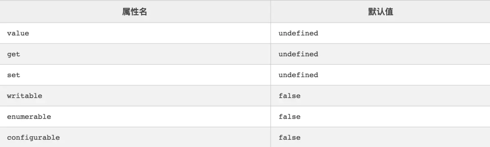

## Object.defineProperty()

---

参考地址：https://www.jianshu.com/p/8fe1382ba135

兼容性：在ie8下只能在DOM对象上使用，尝试在原生的对象使用 Object.defineProperty()会报错。

### 简介

**1 Object.defineProperty()语法说明**
```
// obj 需要定义属性的当前对象
// prop 当前需要定义的属性名
// desc 属性描述符
Object.defineProperty(obj, prop, desc)
```

javacript 有三种类型的属性:
1. 命名数据属性：拥有一个确定的值的属性。这也是最常见的属性
2. 命名访问器属性：通过getter和setter进行读取和赋值的属性
3. 内部属性：由JavaScript引擎内部使用的属性，不能通过JavaScript代码直接访问到，不过可以通过一些方法间接的读取和设置。比如，每个对象都有一个内部属性[[Prototype]]，你不能直接访问这个属性，但可以通过Object.getPrototypeOf()方法间接的读取到它的值。虽然内部属性通常用一个双吕括号包围的名称来表示，但实际上这并不是它们的名字，它们是一种抽象操作，是不可见的，根本没有上面两种属性有的那种字符串类型的属性


**2 数据描述符 --特有的两个属性（value,writable）**
```
let Person = {}
Object.defineProperty(Person, 'name', {
   value: 'jack',
   writable: true // 是否可以改变
})
```



1. writable 描述属性是否可修改
2. configrable 描述属性是否配置，以及可否删除
3. enumerable 描述属性是否会出现在for in 或者 Object.keys()的遍历中

**3 存取描述符 --是由一对 getter、setter 函数功能来描述的属性**

1. get：一个给属性提供getter的方法，如果没有getter则为undefined。该方法返回值被用作属性值。默认为undefined。
2. set：一个给属性提供setter的方法，如果没有setter则为undefined。该方法将接受唯一参数，并将该参数的新值分配给该属性。默认值为undefined。

```
let Person = {}
let temp = null
Object.defineProperty(Person, 'name', {
  get: function () {
    return temp
  },
  set: function (val) {
    temp = val
  }
})
```


**4 其他方法**

1. Object.preventExtensions(Person) 禁止扩展
2. Object.seal() 创建一个密封的对象，这个方法实际上会在一个现有对象上调用object.preventExtensions(...)并把所有现有属性标记为configurable:false。
3. Object.freeze() 创建一个冻结对象，这个方法实际上会在一个现有对象上调用Object.seal(),并把所有现有属性标记为writable: false,这样就无法修改它们的值。