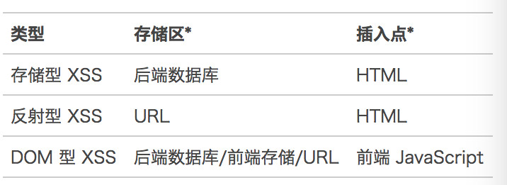
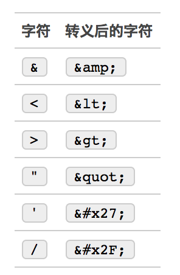

## XSS 攻击

---

参考：https://mp.weixin.qq.com/s/JVrInetNatA8PRfgzpLIMg

### 什么是 XSS 攻击？

**XSS 即（Cross Site Scripting）中文名称为：跨站脚本攻击**。XSS 的重点不在于跨站点，而在于脚本的执行。那么 XSS 的原理是：
恶意攻击者在 web 页面中会插入一些恶意的 script 代码。当用户浏览该页面的时候，那么嵌入到 web 页面中 script 代码会执行，因此会达到恶意攻击用户的目的。那么 XSS 攻击最主要有如下分类：反射型、存储型、及 DOM-based 型。 反射性和 DOM-baseed 型可以归类为非持久性 XSS 攻击。存储型可以归类为持久性 XSS 攻击。

可以窃取 Cookie 信息，监听用户行为（监听键盘事件），通过修改 DOM 伪造假的登录窗口，还可以在页面内生成浮窗广告。

### XSS 攻击类型

XSS 的本质是：恶意代码未经过滤，与网站正常的代码混在一起；浏览器无法分辨哪些脚本是可信的，导致恶意脚本被执行。

**1 存储型 XSS**

存储型 XSS 的原理是：主要是将恶意代码上传或存储到服务器中，下次只要受害者浏览包含此恶意代码的页面就会执行恶意代码。

这种攻击常见于带有用户保存数据的网站功能，如论坛发帖、商品评论、用户私信等。

**2 反射型 XSS**

反射性 XSS 的原理是：反射性 xss 一般指攻击者通过特定的方式来诱惑受害者去访问一个包含恶意代码的 URL。当受害者点击恶意链接 url 的时候，恶意代码会直接在受害者的主机上的浏览器执行。

反射型 XSS 漏洞常见于通过 URL 传递参数的功能，如网站搜索、跳转等。

**3 DOM-based 型 XSS**

客户端的 js 可以对页面 dom 节点进行动态的操作，比如插入、修改页面的内容。比如说客户端从 URL 中提取数据并且在本地执行、如果用户在客户端输入的数据包含了恶意的 js 脚本的话，但是这些脚本又没有做任何过滤处理的话，那么我们的应用程序就有可能受到 DOM-based XSS 的攻击。

DOM 型 XSS 跟前两种 XSS 的区别：DOM 型 XSS 攻击中，取出和执行恶意代码由浏览器端完成，属于前端 JavaScript 自身的安全漏洞，而其他两种 XSS 都属于服务端的安全漏洞。

DOM XSS 是基于文档对象模型的 XSS。一般有如下 DOM 操作：

1. 使用 document.write 直接输出数据。
2. 使用 innerHTML 直接输出数据。
3. 使用 location、location.href、location.replace、iframe.src、document.referer、window.name 等这些。

### XSS 攻击防范手段

通过前面的介绍可以得知，XSS 攻击有两大要素：

1. 攻击者提交恶意代码。
2. 浏览器执行恶意代码。

针对第一个要素：我们是否能够在用户输入的过程，过滤掉用户输入的恶意代码呢？

**1 输入过滤**

1. 长度校验
2. 转义
   

**2 CSP 内容安全策略**

严格的 CSP 在 XSS 的防范中可以起到以下的作用：

- 禁止加载外域代码，防止复杂的攻击逻辑。
- 禁止外域提交，网站被攻击后，用户的数据不会泄露到外域。
- 禁止内联脚本执行（规则较严格，目前发现 github 使用）。
- 禁止未授权的脚本执行（新特性，Google Map 移动版在使用）。
- 合理使用上报可以及时发现 XSS，利于尽快修复问题。

**3 cookie 安全策略**
在服务器端设置 cookie 的时候设置 http-only, 这样就可以防止用户通过 JS 获取 cookie。对 cookie 的读写或发送一般有如下字段进行设置：

1. http-only: 只允许 http 或 https 请求读取 cookie、JS 代码是无法读取 cookie 的(document.cookie 会显示 http-only 的 cookie 项被自动过滤掉)。发送请求时自动发送 cookie.
2. secure-only: 只允许 https 请求读取，发送请求时自动发送 cookie。
3. host-only: 只允许主机域名与 domain 设置完成一致的网站才能访问该 cookie。
