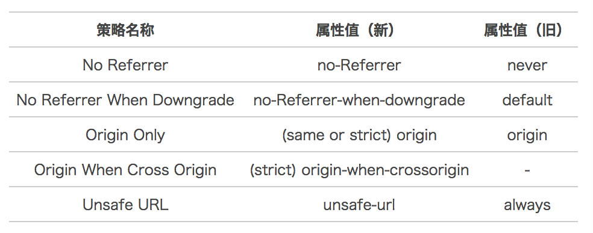

## CSRF 攻击

---

参考：https://mp.weixin.qq.com/s/sYoccR4-qM4crgkQBYvSpA

### 什么是 CSRF 攻击？

**CSRF（Cross-site request forgery）跨站请求伪造**：攻击者诱导受害者进入第三方网站，在第三方网站中，向被攻击网站发送跨站请求。利用受害者在被攻击网站已经获取的注册凭证，绕过后台的用户验证，达到冒充用户对被攻击的网站执行某项操作的目的。

一个典型的 CSRF 攻击有着如下的流程：

1. 受害者登录 a.com，并保留了登录凭证（Cookie）。
2. 攻击者引诱受害者访问了 b.com。
3. b.com 向 a.com 发送了一个请求：a.com/act=xx。浏览器会默认携带 a.com 的 Cookie。
4. a.com 接收到请求后，对请求进行验证，并确认是受害者的凭证，误以为是受害者自己发送的请求。
5. a.com 以受害者的名义执行了 act=xx。
6. 攻击完成，攻击者在受害者不知情的情况下，冒充受害者，让 a.com 执行了自己定义的操作。

### CSRF 攻击类型

CSRF 通常是跨域的，因为外域通常更容易被攻击者掌控。但是如果本域下有容易被利用的功能，比如可以发图和链接的论坛和评论区，攻击可以直接在本域下进行，而且这种攻击更加危险。

特点：

- 攻击一般发起在第三方网站，而不是被攻击的网站。被攻击的网站无法防止攻击发生。
- 攻击利用受害者在被攻击网站的登录凭证，冒充受害者提交操作；而不是直接窃取数据。
- 整个过程攻击者并不能获取到受害者的登录凭证，仅仅是“冒用”。
- 跨站请求可以用各种方式：图片 URL、超链接、CORS、Form 提交等等。部分请求方式可以直接嵌入在第三方论坛、文章中，难以进行追踪。

**1 GET 类型的 CSRF**

GET 类型的 CSRF 利用非常简单，只需要一个 HTTP 请求，一般会这样利用：

```

```

在受害者访问含有这个 img 的页面后，浏览器会自动向http://bank.example/withdraw?account=xiaoming&amount=10000&for=hacker发出一次HTTP请求。bank.example就会收到包含受害者登录信息的一次跨域请求。

**2 POST 类型的 CSRF**

这种类型的 CSRF 利用起来通常使用的是一个自动提交的表单，如：

```
<form action="http://bank.example/withdraw" method=POST>
    <input type="hidden" name="account" value="xiaoming" />
    <input type="hidden" name="amount" value="10000" />
    <input type="hidden" name="for" value="hacker" />
</form>
<script> document.forms[0].submit(); </script>
```

访问该页面后，表单会自动提交，相当于模拟用户完成了一次 POST 操作。

**3 链接类型的 CSRF**

链接类型的 CSRF 并不常见，比起其他两种用户打开页面就中招的情况，这种需要用户点击链接才会触发。这种类型通常是在论坛中发布的图片中嵌入恶意链接，或者以广告的形式诱导用户中招，攻击者通常会以比较夸张的词语诱骗用户点击，例如：

```
<a href="http://test.com/csrf/withdraw.php?amount=1000&for=hacker" taget="_blank">
  重磅消息！！
  <a/>
```

由于之前用户登录了信任的网站 A，并且保存登录状态，只要用户主动访问上面的这个 PHP 页面，则表示攻击成功。

### CSRF 攻击防范手段

上文中讲了 CSRF 的两个特点：

- CSRF（通常）发生在第三方域名。
- CSRF 攻击者不能获取到 Cookie 等信息，只是使用。

针对这两点，我们可以专门制定防护策略，如下：

- 阻止不明外域的访问
  - 同源检测
  - Samesite Cookie
- 提交时要求附加本域才能获取的信息
  - CSRF Token
  - 双重 Cookie 验证

**1 同源检测**

在 HTTP 协议中，每一个异步请求都会携带两个 Header，用于标记来源域名：

- Origin Header
- Referer Header

服务器可以通过解析这两个 Header 中的域名，确定请求的来源域。

**Origin 在以下两种情况下并不存在**：

- IE11 同源策略： IE 11 不会在跨站 CORS 请求上添加 Origin 标头，Referer 头将仍然是唯一的标识。最根本原因是因为 IE 11 对同源的定义和其他浏览器有不同，有两个主要的区别：（1）两个相互之间高度互信的域名，如公司域名（corporate domains），则不受同源策略限制（2）IE 未将端口号纳入到同源策略的检查中，可以参考 [MDN Same-origin_policy#IE_Exceptions](https://developer.mozilla.org/zh-CN/docs/Web/Security/Same-origin_policy#ie_%E4%B8%AD%E7%9A%84%E7%89%B9%E4%BE%8B)

- 302 重定向： 在 302 重定向之后 Origin 不包含在重定向的请求中，因为 Origin 可能会被认为是其他来源的敏感信息。对于 302 重定向的情况来说都是定向到新的服务器上的 URL，因此浏览器不想将 Origin 泄漏到新的服务器上。

**Referer Header 也可能不存在**
2014 年，W3C 的 Web 应用安全工作组发布了 Referrer Policy 草案，对浏览器该如何发送 Referer 做了详细的规定。



根据上面的表格因此需要把 Referrer Policy 的策略设置成 same-origin，对于同源的链接和引用，会发送 Referer，referer 值为 Host 不带 Path；跨域访问则不携带 Referer。例如：aaa.com 引用 bbb.com 的资源，不会发送 Referer。

设置 Referrer Policy 的方法有三种：

- 在 CSP 设置
- 页面头部增加 meta 标签
- a 标签增加 referrerpolicy 属性

上面说的这些比较多，但我们可以知道一个问题：攻击者可以在自己的请求中隐藏 Referer。如果攻击者将自己的请求这样填写：

```

```

那么这个请求发起的攻击将不携带 Referer。

**2 CSRF Token**

CSRF Token 的防护策略分为三个步骤：

1. 将 CSRF Token 输出到页面中
2. 页面提交的请求携带这个 Token
3. 服务器验证 Token 是否正确
   当用户从客户端得到了 Token，再次提交给服务器的时候，服务器需要判断 Token 的有效性，验证过程是先解密 Token，对比加密字符串以及时间戳，如果加密字符串一致且时间未过期，那么这个 Token 就是有效的。

Token 是一个比较有效的 CSRF 防护方法，只要页面没有 XSS 漏洞泄露 Token，那么接口的 CSRF 攻击就无法成功。

```
验证码和密码其实也可以起到 CSRF Token 的作用哦，而且更安全。
为什么很多银行等网站会要求已经登录的用户在转账时再次输入密码，现在是不是有一定道理了？
```

**3 双重 Cookie 验证**

双重 Cookie 采用以下流程：

- 在用户访问网站页面时，向请求域名注入一个 Cookie，内容为随机字符串（例如 csrfcookie=v8g9e4ksfhw）。
- 在前端向后端发起请求时，取出 Cookie，并添加到 URL 的参数中（接上例 POST https://www.a.com/comment?csrfcookie=v8g9e4ksfhw）。
- 后端接口验证 Cookie 中的字段与 URL 参数中的字段是否一致，不一致则拒绝。

此方法相对于 CSRF Token 就简单了许多。可以直接通过前后端拦截的的方法自动化实现。后端校验也更加方便，只需进行请求中字段的对比，而不需要再进行查询和存储 Token。

但是：**跨域情况下不适合，为了确保 Cookie 传输安全，采用这种防御方式的最好确保用整站 HTTPS 的方式，如果还没切 HTTPS 的使用这种方式也会有风险。**

**4 Samesite Cookie 属性**

```
Set-Cookie: foo=1; Samesite=Strict //严格模式
Set-Cookie: bar=2; Samesite=Lax //宽松模式
Set-Cookie: baz=3; Samesite=None //不阻止
```

如果 SamesiteCookie 被设置为 Strict，浏览器在任何跨域请求中都不会携带 Cookie，新标签重新打开也不携带，所以说 CSRF 攻击基本没有机会。

但是跳转子域名或者是新标签重新打开刚登陆的网站，之前的 Cookie 都不会存在。尤其是有登录的网站，那么我们新打开一个标签进入，或者跳转到子域名的网站，都需要重新登录。对于用户来讲，可能体验不会很好。

如果 SamesiteCookie 被设置为 Lax，那么其他网站通过页面跳转过来的时候可以使用 Cookie，可以保障外域连接打开页面时用户的登录状态。但相应的，其安全性也比较低。

另外一个问题是 Samesite 的兼容性不是很好，现阶段除了从新版 Chrome 和 Firefox 支持以外，Safari 以及 iOS Safari 都还不支持，现阶段看来暂时还不能普及。

总之，SamesiteCookie 是一个可能替代同源验证的方案，但目前还并不成熟，其应用场景有待观望。
