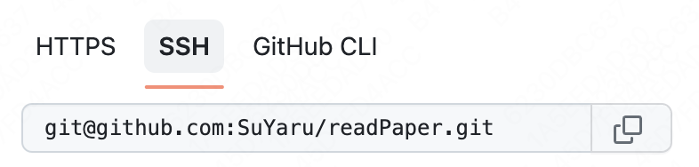

### http 与 https 的区别**

https (超文本传输协议)是支持加密和验证的http。https 使用TLS(Transport Layer Security) / SSL 对普通请求和响应进行加密和数字签名。两者都是通信协议，比如像github 自带三种clone 方式，支持不同加密方式

现在TLS 已经取代了SSL证书

### 对称加密和非对称加密**

根据秘钥的数量和方向分为对称加密（DES && AES）和非对称加密
（RSA && ECC），对称加密只有一把秘钥，非对称加密使用两把秘钥（公钥和私钥）。
 - 对称加密：只用一把秘钥，故解密速度快，可以用于数据量大的加解密；AES 长度有 128、192、256 位，根据秘钥的长短进行不同轮次的加密，其中主要包括字节替换、行位移、列混合等方式
 - 对称加密：唯一的一把秘钥容易泄露，一旦被获取可以被解密；每次加密时需要生成一把新的秘钥，故对秘钥的管理难度大
 - 非对称加密：公钥用于加密，私钥用于解密；但是非对称加密很慢
 区别：耗时不同、安全性不同、加密流程不同

### TCP三次握手&&断联4次挥手**

 - 三次握手（为了确认双端收发没问题）：
   1. 客户端 ——-> 服务端：我要向你发送通知啦（客户端发送正常）
   2. 客户端 <—— 服务端（同时响应和发送报文；服务端接收正常和发送正常）：好的，你发吧
   3. 客户端 ——-> 服务端（客户端的接收正常）：好的，那我发了，今天xx。如果没有第三次握手，服务端会一直等客户端发消息，造成服务端资源的浪费。
 - 四次挥手（为了关闭双工）：
   1. 客户端 ——-> 服务端：我要关闭通知啦（携带报文. 客户端不再发送数据，但还可以接收数据）
   2. 客户端 <—— 服务端：好的，知道啦，我去结束服务（确认响应）
   3. 客户端 <—— 服务端：【服务端收拾好最后报文，需要一段时间】（将报文传输回去）；
   4. 客户端 ——-> 服务端：好的，收到