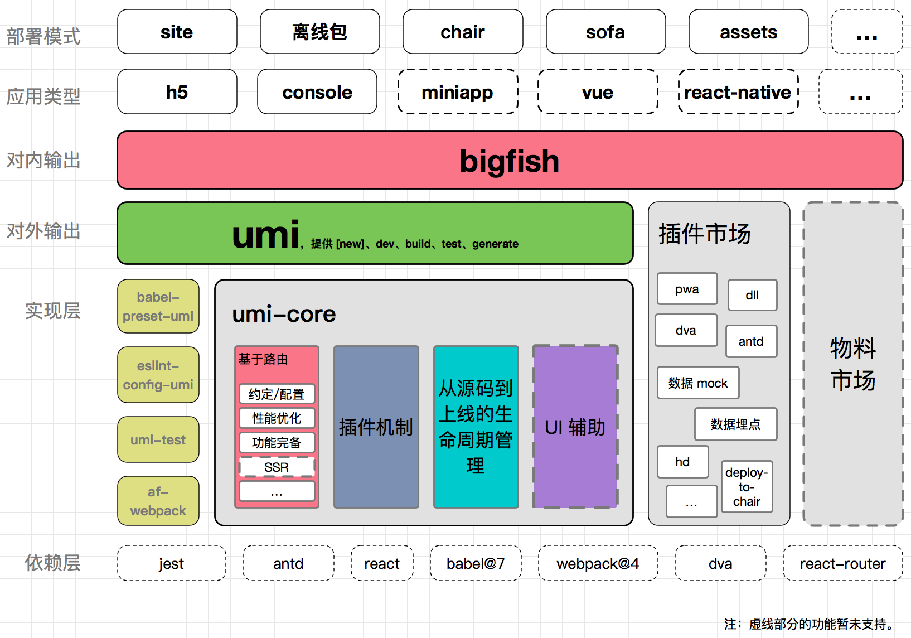

## UmiJS

---

参考地址：https://v2.umijs.org/

### 介绍

umi，是一个可插拔的企业级 react 应用框架。umi 以路由为基础的，支持类 next.js 的约定式路由，以及各种进阶的路由功能，并以此进行功能扩展，比如支持路由级的按需加载。然后配以完善的插件体系，覆盖从源码到构建产物的每个生命周期，支持各种功能扩展和业务需求，目前内外部加起来已有 50+ 的插件。

Umi 内置了路由、构建、部署、测试等，仅需一个依赖即可上手开发。
### 架构



### 目录及约定
```
.
├── dist/                          // 默认的 build 输出目录
├── mock/                          // mock 文件所在目录，基于 express
├── config/
    ├── config.js                  // umi 配置，同 .umirc.js，二选一
└── src/                           // 源码目录，可选
    ├── layouts/index.js           // 全局布局
    ├── pages/                     // 页面目录，里面的文件即路由
        ├── .umi/                  // dev 临时目录，需添加到 .gitignore
        ├── .umi-production/       // build 临时目录，会自动删除
        ├── document.ejs           // HTML 模板
        ├── 404.js                 // 404 页面
        ├── page1.js               // 页面 1，任意命名，导出 react 组件
        ├── page1.test.js          // 用例文件，umi test 会匹配所有 .test.js 和 .e2e.js 结尾的文件
        └── page2.js               // 页面 2，任意命名
    ├── global.css                 // 约定的全局样式文件，自动引入，也可以用 global.less
    ├── global.js                  // 可以在这里加入 polyfill
    ├── app.js                     // 运行时配置文件
├── .umirc.js                      // umi 配置，同 config/config.js，二选一
├── .env                           // 环境变量
└── package.json
```

