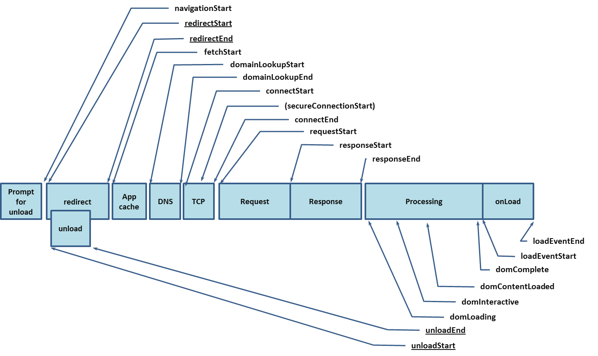

### 性能优化指标定义

---

##### 基础技术指标

参考：[web 计时机制——performance 对象](https://www.cnblogs.com/xiaohuochai/p/6523397.html)

Performace 接口允许访问当前页面性能相关的信息。它是 High Resolution Time API 的一部分。但是它被 Performance Timeline API, the Navigation Timing API, the User Timing API, and the Resource Timing API 扩展增强了。实际上 Performance 的主要功能都是由这几个 API 提供的。

**1 memory**

memory 是 Chrome 添加的一个非标准扩展，这个属性提供了一个可以获取到基本内存使用情况的对象。不应该使用这个非标准的 API。

```
jsHeapSizeLimit: 2172649472 //内存大小限制，以字节计算。
totalJSHeapSize: 10554890 //可使用的内存，以字节计算。
usedJSHeapSize: 9759662 //javascript对象占用的内存，以字节计算。
```

**2 navigation**

performance.navigation 属性是一个对象，包含着与页面导航有关的 redirectCount 和 type 这两个属性

其中 redirectCount 表示页面加载前的重定向次数；而 type 是一个数值常量，表示刚刚发生的导航类型，type 有以下取值：

```
performance.navigation.TYPE_NAVTGATE(0) //页面第一次加载
performance.navigation.TYPE_RELOAD(1) //页面重载过
performance.navigation.TYPE_BACK_FORWARD(2) //页面是通过“后退”或“前进”按钮打开的
```

**3 timeOrigin**

表示 performance 性能测试开始的时间。是一个高精度时间戳（千分之一毫秒）

**4 timing**

performance.timing 属性也是一个对象，但这个对象的属性都是时间戳，不同的事件会产生不同的时间值

该属性已经被废弃，请使用 Performance.timeOrigin 替代。

下图显示了一个请求发出的整个过程中，各种环节的时间顺序



- navigationStart:开始导航到当前页面的时间，即在地址栏输入地址后按下回车时的时间

- redirectStart:到当前页面的重定向开始的时间。**但只有在重定向的页面来自同一个域时这个属性才会有值；否则，值为 0**
- redirectEnd:到当前页面的重定向结束的时间。**但只有在重定向的页面来自同一个域时这个属性才会有值；否则，值为 0**

  ```
  //重定向时间
  redirectEnd - redirectStart
  ```

- fetchStart:开始通过 HTTP GET 取得页面的时间

- domainLookupStart:开始査询当前页面 DNS 的时间，如果使用了本地缓存或持久连接，则与 fetchStart 值相等
- domainLookupEnd:査询当前页面 DNS 结束的时间，如果使用了本地缓存或持久连接，则与 fetchStart 值相等

  ```
  //DNS查询时间
  domainLookupEnd - domainLookupStart
  ```

- connectStart:浏览器尝试连接服务器的时间
- secureConnectionStart:浏览器尝试以 SSL 方式连接服务器的时间。不使用 SSL 方式连接时，这个属性的值为 0
- connectEnd:浏览器成功连接到服务器的时间

  ```
  //TCP连接时间
  connectEnd - connectStart
  //SSL连接时间
  connectEnd - secureConnectionStart
  ```

- requestStart:浏览器开始请求页面的时间
- responseStart:浏览器接收到页面第一字节的时间
- responseEnd:浏览器接收到页面所有内容的时间

  ```
  //请求文档时间
  responseStart - requestStart
  //接收文档时间
  responseEnd - responseStart
  ```

- domLoading:document.readyState 变为"loading"的时间，即开始解析 DOM 树的时间
- domInteractive:document.readyState 变为"interactive"的时间，即完成完成解析 DOM 树的时间

  ```
  //解析DOM树的时间
  domInteractive - domLoading
  ```

- domContentLoadedEventStart:发生 DOMContentloaded 事件的时间，即开始加载网页内资源的时间
- domContentLoadedEventEnd:DOMContentLoaded 事件已经发生且执行完所有事件处理程序的时间，网页内资源加载完成的时间
- domComplete:document.readyState 变为"complete"的时间，即 DOM 树解析完成、网页内资源准备就绪的时间

  ```
  // 页面渲染时间
  // 不准确，现代浏览器可以提前渲染
  domComplete-domContentLoaded
  ```

- loadEventStart:发生 load 事件的时间，也就是 load 回调函数开始执行的时间
- loadEventEnd:load 事件已经发生且执行完所有事件处理程序的时间

  ```
  //load回调函数执行时间
  loadEventEnd - loadEventStart
  ```

**5 now()**

now()方法返回从页面初始化到调用该方法时的毫秒数

[注意]IE9-浏览器不支持

performance.now()与 Date.now()不同的是，返回了以微秒为单位的时间，更加精准

并且与 Date.now()会受系统程序执行阻塞的影响不同，performance.now()的时间是以恒定速率递增的，不受系统时间的影响(系统时间可被人为或软件调整)

Date.now()输出的是 UNIX 时间，即距离 1970 年 1 月 1 日 0 点的时间，而 performance.now()输出的是相对于 performance.timing.navigationStart(页面初始化)的时间

```
var t0 = window.performance.now();
doSomething();
var t1 = window.performance.now();
console.log("doSomething函数执行了" + (t1 - t0) + "毫秒.")
```

**6 getEntries()**

let p = window.performance.getEntries()

```
JS 资源数量: p.filter(ele => ele.initiatorType === "script").length

CSS 资源数量：p.filter(ele => ele.initiatorType === "css").length

AJAX 请求数量：p.filter(ele => ele.initiatorType === "xmlhttprequest").length

IMG 资源数量：p.filter(ele => ele.initiatorType === "img").length

总资源数量: window.performance.getEntriesByType("resource").length
```

##### 用户体验指标

这类指标用来衡量⽤户的真实体验，从用户体验的角度出发，如首屏时间，白屏时间，完全加载时间之类，即用户能实际感觉到得网页加载延迟。

**1 FP/FCP**

First Paint，**首次绘制，这个指标用于记录页面第一次绘制像素的时间**。FP 是当浏览器开始绘制内容到屏幕上的时候，只要在视觉上开始发生变化，无论是什么内容触发的视觉变化，这个时间点叫做 FP。

First Contentful Paint，是指浏览器首次绘制来自 DOM 第一位内容的时间，**内容必须是文本、图片（包含背景图）、非白色的 canvas 或 SVG，也包括带有正在加载中的 Web 字体的文本**。

总结：在这个节点页面不在是白屏，而是已有像素绘制到屏幕（不管是灰色背景还是具体的文字、图片像素），它给用户的感受就是页面开始有响应了，接下来就是等待它继续完成其他内容的响应。我们可以称之为白屏时间。**它回答了是否发生？**

时间获取

```
performance.getEntriesByType('paint');
{
    duration: 0
    entryType: "paint"
    name: "first-paint"
    startTime: 230.34499998902902
}
{
    duration: 0
    entryType: "paint"
    name: "first-contentful-paint"
    startTime: 230.34499998902902
}
```

**2 FMP**

First Meaningful Paint，是首屏有意义的内容绘制，有意义可以是视频网站的视频控件，内容网站的页面框架，也可以是资源网站的头图等，这个“有意义”没有权威的规定，需要根据具体站点内容来评估。

总结：有意义的内容已经展示。**它回答了是否有用？**

**3 TTI**

Time to Interactive，可交互时间，指标用于标记应用已进行视觉渲染并能可靠响应用户输入的时间点。

初步使用 loadEventEnd 为改标识点
