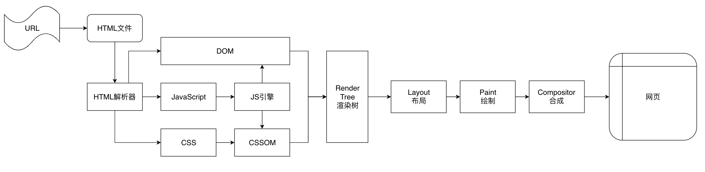
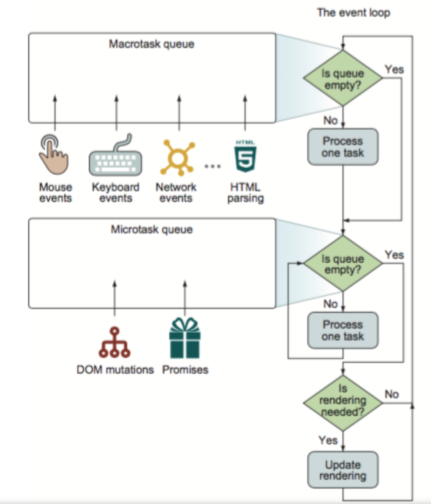

## 页面渲染流程

---

### 浏览器渲染主要流程

1. HTML 解析出 DOM Tree
2. CSS 解析出 Style Rules
3. 将二者关联生成 Render Tree
4. Layout 根据 Render Tree 计算每个节点的信息
5. Painting 根据计算好的信息绘制整个页面

**注意：现代浏览器会尽可能早的将内容呈现到屏幕上，并不会等到所有的 html 都解析完成之后再去构建和布局 render tree。它是解析完一部分内容就显示一部分内容，同时，可能还在通过网络下载其余内容。**

**浏览器预解析**：webkit 和 firefox 做了这个优化，当 js 执行时，另外一个线程解析剩下的文档，并加载需要网络请求的资源，预解析不会改变 DOM 树，还是留给主线程解析，自己只解析外部资源的引用。

**CSS 阻塞文档解析**：本身 CSS 加载不会阻塞 DOM 的解析，但是 js 会改变 CSSOM，所以浏览器会延迟 JS 的执行和 DOM 的解析，等待 CSS 下载并完成 CSSOM 的构建，然后再执行 JS 和解析 DOM。（注意：CSS 不会阻塞文档解析，只会阻塞其渲染。）

### 浏览器提前渲染主要原因

最早的浏览器都是 CSSOM 和 DOM 构建完成，生成 Render Tree 之后，才开始渲染的，这样的话，其实 FP 和 FCP 都是一样的。但是现代浏览器为达到更好的用户体验，渲染引擎会力求尽快将内容显示在屏幕上。**它不必等到整个 HTML 文档解析完毕之后，就会开始构建 DOM，并采用默认样式生成 Render Tree 和设置布局，就可以进行局部 DOM 的渲染**。在不断接收和处理来自网络的其余内容的同时，渲染引擎会将部分内容解析并显示出来。

通过查看 FP 和 FCP 的规范：发现 update the rendering 其实就是 Event Loop 的一部分，会在执行了宏任务和微任务后，开始执行 update rendering，在这个时候会记录 FP、FCP 的时间。

**将 update rendering 关键点翻译成中文**：
执行 update rendering ，浏览器判断 document 在此时间点渲染是否会『获益』。浏览器只需保证 60Hz 的刷新率即可（在机器负荷重时还会降低刷新率），若 event loop 频率过高，即使渲染了浏览器也无法及时展示。所以并不是每轮 eventloop 都会执行 UI Render。

**那么浏览器是如何做到，边解析边绘制呢？**

查看 [HTML parse 的规范](https://html.spec.whatwg.org/multipage/parsing.html#html-parser)，发现，如果遇到</script>标签，如果当前文档存在阻碍 JS 执行的 CSS 或者当前的脚本 不处于 ready to be parser-executed 状态，则 spin the event loop，直到不再存在阻碍 JS 执行的 CSS 且该段脚本处于 ready to be parser-executed。
我们已经知道 CSS 的加载是会阻碍 JS 执行的。而脚本不处于这个 ready to be parser-executed 状态简单理解就是还没下载完。如果出现这两种情况，脚本就无法立刻执行，需要等待。此时要进行 spin the eventloop，查阅[规范](https://html.spec.whatwg.org/multipage/webappapis.html#spin-the-event-loop)，该操作即为：

1. 暂存此时正在执行的 task 或 microtask
2. 暂存此时的 JS 执行上下文堆栈
3. 清空 JS 执行上下文堆栈
4. 停止执行当前的 task/microtask，继续执行 eventloop 的主流程，执行下一个 task。
5. 当满足条件时，重新添加之前暂存的 task/microtask，恢复暂存的 JS 执行上下文堆栈，继续执行。

简单的说就是让 eventloop 中断并暂存当前正在执行的 task/microtask，保持 eventloop 的继续执行，待一段时间之后满足条件了再恢复之前的 task/microtask。

那么问题就水落石出了：
**如果在 HTML 解析过程中，解析到了某个脚本，但这个脚本被 CSS 阻塞住了或者还没下载完，则会中断暂存当前的解析 task，继续执行 eventloop，网页被渲染。**
