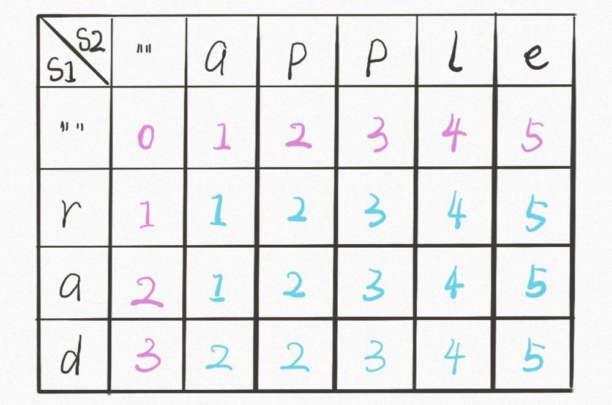

### 最短编辑距离

---

leetcode 原题：https://leetcode-cn.com/problems/edit-distance/

##### 递归+备忘录

```
var minDistance = function (word1, word2) {
  const len1 = word1.length;
  const len2 = word2.length;
  const cacheArr = Array.from(new Array(len1), (item) =>
    new Array(len2).fill(0)
  );
  function dp(i, j) {
    if (i < 0) return j + 1;
    if (j < 0) return i + 1;
    if (cacheArr[i][j]) return cacheArr[i][j];
    if (word1[i] === word2[j]) {
      return dp(i - 1, j - 1);
    } else {
      //取插入、删除、替换操作的最小值
      cacheArr[i][j] =
        Math.min(dp(i, j - 1), dp(i - 1, j), dp(i - 1, j - 1)) + 1;
      return cacheArr[i][j];
    }
  }
  return dp(len1 - 1, len2 - 1);
};
```

##### DP table

图解：


```
var minDistance = function (word1, word2) {
  const len1 = word1.length;
  const len2 = word2.length;
  const cacheArr = Array.from(new Array(len1 + 1), () =>
    new Array(len2 + 1).fill(0)
  );
  for (let i = 1; i <= len1; i++) {
    cacheArr[i][0] = i;
  }
  for (let j = 1; j <= len2; j++) {
    cacheArr[0][j] = j;
  }
  for (let i = 1; i <= len1; i++) {
    for (let j = 1; j <= len2; j++) {
      if (word1[i - 1] == word2[j - 1]) {
        cacheArr[i][j] = cacheArr[i - 1][j - 1];
      } else {
        cacheArr[i][j] =
          Math.min(
            cacheArr[i - 1][j - 1],
            cacheArr[i - 1][j],
            cacheArr[i][j - 1]
          ) + 1;
      }
    }
  }
  return cacheArr[len1][len2];
};
```
