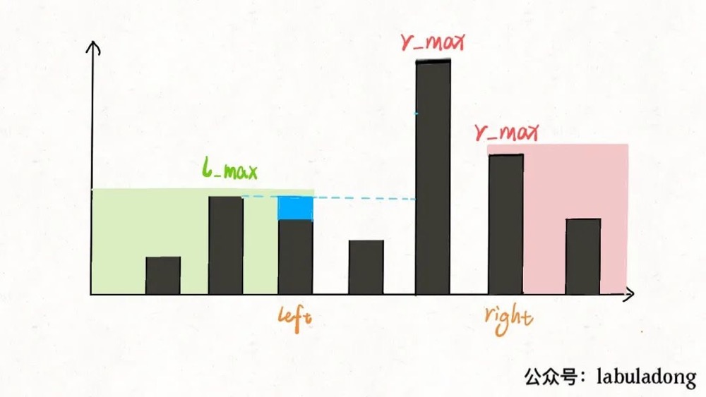

### 接雨水

---

LeetCode 原题：https://leetcode-cn.com/problems/trapping-rain-water/

##### 暴力解法

```
var trap = function(height) {
    const len=height.length;
    if(len<3) return 0;
    let res=0;
    for(let i=1;i<len-1;i++){
        let leftMaxHeight=0;
        let rightMaxHeight=0;
        //左边最高
        for(j=0;j<=i;j++){
            leftMaxHeight=Math.max(height[j],leftMaxHeight)
        }
        //右边最高
        for(j=i;j<len;j++){
            rightMaxHeight=Math.max(height[j],rightMaxHeight)
        }
        res+=Math.min(leftMaxHeight,rightMaxHeight)-height[i];
    }
    return res;
};
```

##### 备忘录提前记录坐标 i 的左边和右边的最大高度

```
var trap = function(height) {
    const len=height.length;
    if(len<3) return 0;
    let res=0;
    const leftMaxHeightArr=[];
    const rightMaxHeightArr=[];
    let leftMaxHeight=0;
    let rightMaxHeight=0;
    for(let i=0;i<len;i++){
        leftMaxHeight=Math.max(height[i],leftMaxHeight);
        leftMaxHeightArr[i]=leftMaxHeight;
    }
    for(let i=len-1;i>=0;i--){
        rightMaxHeight=Math.max(height[i],rightMaxHeight);
        rightMaxHeightArr[i]=rightMaxHeight;
    }
    for(let i=1;i<len-1;i++){
        res+=Math.min(leftMaxHeightArr[i],rightMaxHeightArr[i])-height[i];
    }
    return res;
};
```

##### 双指针法



此时的 l_max 是 left 指针左边的最高柱子，但是 r_max 并不一定是 left 指针右边最高的柱子，这真的可以得到正确答案吗？

其实这个问题要这么思考，我们只在乎 min(l_max, r_max)。对于上图的情况，我们已经知道 l_max < r_max 了，至于这个 r_max 是不是右边最大的，不重要。重要的是 height[i]能够装的水只和较低的 l_max 之差有关：

```
var trap = function(height) {
    const len=height.length;
    if(len<3) return 0;
    let left=0;
    let right=len-1;
    let maxLeft=0,maxRight=0,res=0;
    while(left<=right){
        maxLeft=Math.max(height[left],maxLeft);
        maxRight=Math.max(height[right],maxRight);
        if(maxLeft<maxRight){
            res+=maxLeft-height[left];
            left++;
        }else{
            res+=maxRight-height[right];
            right--;
        }
    }
    return res;
};
```
