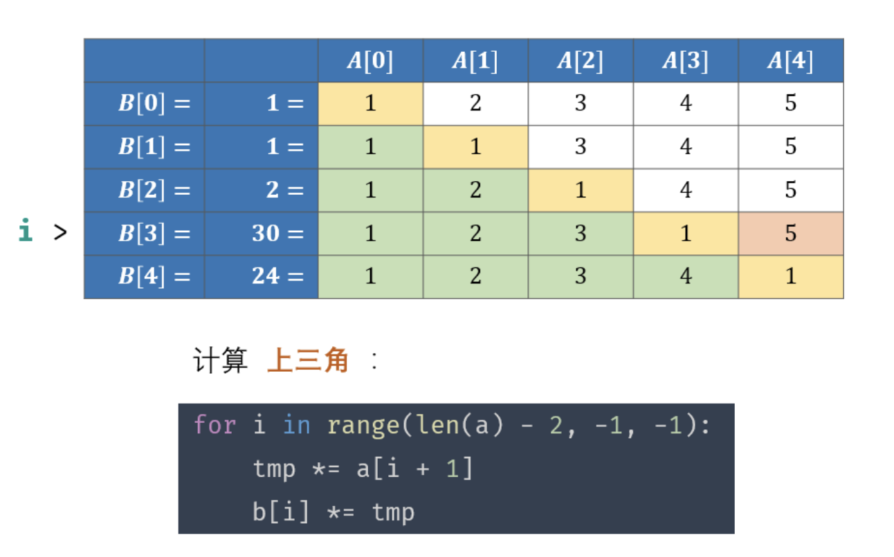

### 计算问题

---

1. 把字符串转换成整数

LeetCode 原题：https://leetcode-cn.com/problems/ba-zi-fu-chuan-zhuan-huan-cheng-zheng-shu-lcof/

正则表达式直接撸

```
var strToInt = function(str) {
    //去除两端空白字符
    str=str.replace(/^\s+|\s+$/g,'');
    //第一个字符不是数字、正号、负号
    if(!/^([\d]|[\+\-]\d)/.test(str)) return 0;
    //去除数字部分
    str=str.replace(/^([\+\-]\d+|\d+)(.*)/g,'$1');
    if(str>Math.pow(2,31)-1) return Math.pow(2,31)-1;
    if(str<-(Math.pow(2,31))) return -(Math.pow(2,31));
    return str;
};
```

2. 构建乘积数组

LeetCode 原题：https://leetcode-cn.com/problems/gou-jian-cheng-ji-shu-zu-lcof/

这是一个比较有意思的题


```
var constructArr = function(a) {
    const len=a.length;
    if(len==0) return [];
    const res=[];
    res[0]=1;
    let temp=1;
    for(let i=1;i<len;i++){
        res[i]=res[i-1]*a[i-1];
    }
    for(let i=len-2;i>=0;i--){
        temp*=a[i+1];
        res[i]*=temp;
    }
    return res;
};
```

3. 求 1+2+…+n

LeetCode 原题：https://leetcode-cn.com/problems/qiu-12n-lcof/

递归解法

```
var sumNums = function(n) {
    return n==1 ? 1 : sumNums(n-1)+n;
};
```
