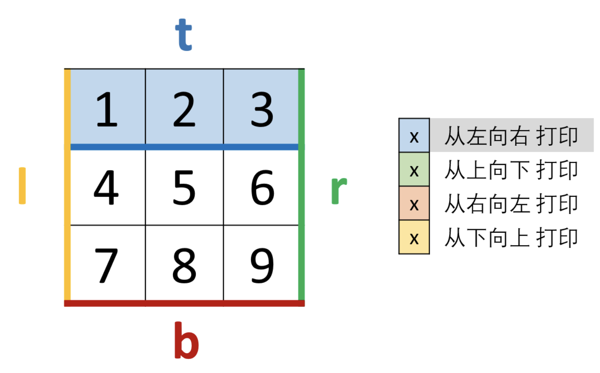

### 字符串数组问题

---

1. 数组中重复的数字

LeetCode 原题：https://leetcode-cn.com/problems/shu-zu-zhong-zhong-fu-de-shu-zi-lcof/

哈希解法，对象存储遍历一次

```
var findRepeatNumber = function(nums) {
    const numsLen=nums.length;
    if(numsLen==0) return -1;
    const cacheObj={};
    for(let i=0;i<numsLen;i++){
        if(!cacheObj[nums[i]]){
            cacheObj[nums[i]]=1;
        }else{
            return nums[i];
        }
    }
    return -1;
};
```

2. 替换空格

LeetCode 原题：https://leetcode-cn.com/problems/ti-huan-kong-ge-lcof/

正则表达式

```
var replaceSpace = function(s) {
    return s.replace(/\s/g,'%20');
};
```

正常遍历

```
var replaceSpace = function(s) {
    let res='';
    let currVal=''
    for(let i=0;i<s.length;i++){
        currVal=s.charAt(i);
        if(currVal==' '){
            res+='%20';
        }else{
            res+=currVal;
        }
    }
    return res;
};
```

3. 顺时针打印矩阵

LeetCode 原题：https://leetcode-cn.com/problems/shun-shi-zhen-da-yin-ju-zhen-lcof/

图解：


思路比较简单，解题的关键在于边界情况的处理

```
var spiralOrder = function(matrix) {
    if(!Array.isArray(matrix) || matrix.length==0) return [];
    let row =matrix.length-1;
    let column=matrix[0].length-1;
    const resArr=[];
    let top=0,left=0;
    let bottom=row,right=column;

    while(top<=bottom || left<=right){
        //添加上边距
        for(let i=left;i<=right;i++){
            resArr.push(matrix[top][i])
        }
        top++;
        //添加右边距
        if(left>right) break;
        for(let i=top;i<=bottom;i++){
            resArr.push(matrix[i][right])
        }
        right--;
        //添加下边距
        if(top>bottom) break;
        for(let i=right;i>=left;i--){
            resArr.push(matrix[bottom][i])
        }
        bottom--;
        //添加左边距
        if(left>right || top>bottom) break;
        for(let i=bottom;i>=top;i--){
            resArr.push(matrix[i][left])
        }
        left++;
    }
    return resArr;
};
```

4. 数组中出现次数超过一半的数字

LeetCode 原题：https://leetcode-cn.com/problems/shu-zu-zhong-chu-xian-ci-shu-chao-guo-yi-ban-de-shu-zi-lcof/

```
var majorityElement = function(nums) {
    if(!Array.isArray(nums)) return null;
    if(nums.length==1) return nums[0];
    const len=nums.length;
    const midlen=Math.floor(len/2);
    const map={};
    for(let i=0;i<len;i++){
        if(map[nums[i]]){
            map[nums[i]]++;
            if(map[nums[i]]>midlen){
                return nums[i];
            }
        }else{
           map[nums[i]]=1;
        }
    }
    return null;
};
```

5. 最小的 k 个数

LeetCode 原题：https://leetcode-cn.com/problems/zui-xiao-de-kge-shu-lcof/

排序加取值

注意：在参数为对象或数组的时候，尽量保证函数里面的操作不会影响元素本身

```
var getLeastNumbers = function(arr, k) {
    const resArr=[...arr];
    resArr.sort((a,b)=>a-b);
    return resArr.slice(0,k);
};
```

这道题估计还是在考察排序，手撕快速排序

可以思考：利用快排思想，考虑这个问题

```
function sortfn(arr){
    if(arr.length<=1) return arr;
    const mid=Math.floor(arr.length/2);
    const midVal=arr.splice(mid,1);
    const leftArr=[];
    const rightArr=[];
    for(let i=0;i<arr.length;i++){
        if(arr[i]<midVal){
            leftArr.push(arr[i]);
        }else{
            rightArr.push(arr[i]);
        }
    }
    return sortfn(leftArr).concat(midVal,sortfn(rightArr));
}
```

6. 第一个只出现一次的字符

LeetCode 原题：https://leetcode-cn.com/problems/di-yi-ge-zhi-chu-xian-yi-ci-de-zi-fu-lcof/

hash 法则

```
var firstUniqChar = function(s) {
    if(!s) return ' ';
    const cacheObj={};
    for(let i=0;i<s.length;i++){
        if(!cacheObj[s[i]]){
            cacheObj[s[i]]=1;
        }else{
             cacheObj[s[i]]++;
        }
    }
    let keyArr= Object.keys(cacheObj);
    for(let i=0;i<keyArr.length;i++){
        if(cacheObj[keyArr[i]]==1) return keyArr[i];
    }
    return ' ';
};
```

7. 翻转单词顺序

LeetCode 原题：https://leetcode-cn.com/problems/fan-zhuan-dan-ci-shun-xu-lcof/

正则，有空可以想象其他方法

```
var reverseWords = function(s) {
    return s.replace(/^\s+|\s+$/g,'').replace(/\s+/g,' ').split(' ').reverse().join(' ');
};
```

8. 左旋转字符串

LeetCode 原题：https://leetcode-cn.com/problems/zuo-xuan-zhuan-zi-fu-chuan-lcof/submissions/

```
var reverseLeftWords = function(s, n) {
    const k=n%s.length;
    return s.slice(k)+s.slice(0,k)
};
```

9. 圆圈中最后剩下的数字

LeetCode 原题：https://leetcode-cn.com/problems/yuan-quan-zhong-zui-hou-sheng-xia-de-shu-zi-lcof/

暴力破解法，后续需细看约瑟夫

```
var lastRemaining = function(n, m) {
    if(n==0 || m==0) return -1;
    if(n==1) return 0;
    let tempArr=[];
    for(let i=0;i<n;i++){
        tempArr.push(i);
    }
    function deleteNum(arr){
        let len=arr.length;
        if(len==1) return arr[0];
        let k=(m-1)%len;
        return deleteNum([...arr.slice(k+1),...arr.slice(0,k)]);
    }
    return deleteNum(tempArr);
};
```
