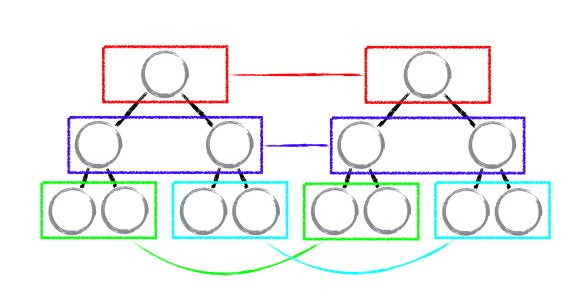
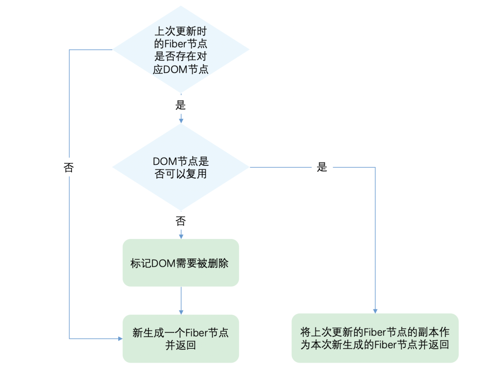

### React Diff

---

参考：
- [React之DOM Diff：如何将算法复杂度控制在O(n)](https://mp.weixin.qq.com/s/L0369dZ-yjUJxIGQK7U4gw)
- [从 0 实现一个 React 系列（三）：Diff算法详解](https://mp.weixin.qq.com/s/Gm-W-S7WlDBVn9oQdaXNVQ)

#### diff原理及总结
    - React的高效得益于其Virtual DOM+React diff的体系。diff算法并非react独创，react只是在传统diff算法做了优化。但因为其优化，将diff算法的时间复杂度一下子从O(n^3)降到O(n)。
    - React diff的三大策略（使用循环而非递归，降低了复杂度）：
        1. Web UI中DOM节点跨层级的移动操作特别少，可以忽略不计。
        
        2. 拥有相同类的两个组件将会生成相似的树形结构，拥有不同类的两个组件将会生成不同的树形结构。
        
        3. 对于同一层级的一组子节点，它们可以通过唯一 id 进行区分。

    - 在开发组件时，保持稳定的 DOM 结构会有助于性能的提升。
    - 在开发过程中，尽量减少类似将最后一个节点移动到列表首部的操作。
    - key的存在是为了提升diff效率，但未必一定就可以提升性能，记住简单列表渲染情况下，不加key要比加key的性能更好。
    - 懂得借助react diff的特性去解决我们实际开发中的一系列问题。


#### 传统Diff算法的瓶颈

在前文中，我们已经了解到react是通过虚拟DOM的Diff来知晓后续的DOM的变更操作。

但是由于 Diff 操作本身也会带来性能损耗，React文档中提到，即使在最前沿的算法中，将前后两棵树完全比对的算法的复杂程度为 O(n 3 )，其中 n 是树中元素的数量。

如果在 React 中使用了该算法，那么展示 1000个元素所需要执行的计算量将在十亿的量级范围。这个开销实在是太过高昂。

#### React Diff 优化策略

React 通过制定大胆的策略，将 O(n^3) 复杂度的问题转换成 O(n) 复杂度的问题。
1. Web UI 中 DOM 节点跨层级的移动操作特别少，可以忽略不计。因此一个DOM节点在前后两次更新中跨越了层级，那么React不会尝试复用他。

    

2. 拥有相同类的两个组件将会生成相似的树形结构，拥有不同类的两个组件将会生成不同的树形结构。如果元素由div变为p，React会销毁div及其子孙节点，并新建p及其子孙节点。
    - 如果是同一类型的组件，按照原策略继续比较 virtual DOM tree。
    - 如果不是，则将该组件判断为 dirty component，从而替换整个组件下的所有子节点。（**正如 React 官方博客所言：不同类型的 component 是很少存在相似 DOM tree 的机会，因此这种极端因素很难在实现开发过程中造成重大影响的。**）
    - 对于同一类型的组件，有可能其 Virtual DOM 没有任何变化，如果能够确切的知道这点那可以节省大量的 diff 运算时间，因此 React 允许用户通过 shouldComponentUpdate() 来判断该组件是否需要进行 diff。

3. 对于同一层级的一组子节点，开发者可以通过 key属性 来暗示哪些子元素在不同的渲染下能保持稳定。
    - INSERT_MARKUP，新的 component 类型不在老集合里， 即是全新的节点，需要对新节点执行插入操作。
    - REMOVE_NODE，老 component 类型，在新集合里也有，但对应的 element 不同则不能直接复用和更新，需要执行删除操作，或者老 component 不在新集合里的，也需要执行删除操作。
    - MOVE_EXISTING，在老集合有新 component 类型，且 element 是可更新的类型，generateComponentChildren 已调用 receiveComponent，这种情况下 prevChild=nextChild，就需要做移动操作，可以复用以前的 DOM 节点。
#### React Fiber 实现

    - fiber 是一种数据结构，可以用纯js对象表示。一个fiber 是一个执行单元，每次执行一个会检查还剩多少时间，时间不够则让渡控制权。
    - 它将一个任务拆分为多个子任务，将递归遍历（O(n^3)）变为循环遍历（O(n^1)）【循环可以随时终止，且复杂度低；递归不可随时终止，且复杂度高】

#### React Diff 实现

###### Diff入口函数

    在函数内部，会根据newChild类型调用不同的处理函数。我们可以从同级的节点数量将Diff分为两类：
    - 当newChild类型为object、number、string，代表同级只有一个节点
    - 当newChild类型为Array，同级有多个节点

    ```
    // 根据newChild类型选择不同diff函数处理
    function reconcileChildFibers(
    returnFiber: Fiber,
    currentFirstChild: Fiber | null,
    newChild: any
    ): Fiber | null {
    const isObject = typeof newChild === "object" && newChild !== null;

    if (isObject) {
        // object类型，可能是 REACT_ELEMENT_TYPE 或 REACT_PORTAL_TYPE
        switch (newChild.$$typeof) {
        case REACT_ELEMENT_TYPE:
        // 调用 reconcileSingleElement 处理
        // ...其他case
        }
    }

    if (typeof newChild === "string" || typeof newChild === "number") {
        // 调用 reconcileSingleTextNode 处理
    }

    if (isArray(newChild)) {
        // 调用 reconcileChildrenArray 处理
    }

    // 一些其他情况调用处理函数

    // 以上都没有命中，删除节点

    return deleteRemainingChildren(returnFiber, currentFirstChild);
    }
    ```
1. 情况一：同级只有一个节点的Diff

    对于单个节点，我们以类型object为例，会进入reconcileSingleElement
    ```
    const isObject = typeof newChild === 'object' && newChild !== null;
    if (isObject) {
        // 对象类型，可能是 REACT_ELEMENT_TYPE 或 REACT_PORTAL_TYPE
        switch (newChild.$$typeof) {
        case REACT_ELEMENT_TYPE:
            // 调用 reconcileSingleElement 处理

            // ...其他case
        }
    }
    ```
    
    其中第二步判断DOM节点是否可以复用，让我们通过代码看看是如何判断的：
    ```
    function reconcileSingleElement(
    returnFiber: Fiber,
    currentFirstChild: Fiber | null,
    element: ReactElement
    ): Fiber {
    const key = element.key;
    let child = currentFirstChild;
    // 首先判断是否存在对应DOM节点
    while (child !== null) {
        // 上一次更新存在DOM节点，接下来判断是否可复用
        if (child.key === key) {
        // 🙋‍♂️同学看这里，首先比较key是否相同
          switch (child.tag) {
            // ...省略case
            default: {
            if (child.elementType === element.type) {
                // 🙋‍♂️同学看这里，key相同后再看type是否相同
                // 如果相同则表示可以复用
                return existing;
            }
            // type不同则跳出循环
            break;
            }
          }
        // 👹 key不同或type不同都代表不能复用，会到这里
        // 不能复用的节点，被标记为删除
        deleteRemainingChildren(returnFiber, child);
        break;
        } else {
        deleteChild(returnFiber, child);
        }
        child = child.sibling;
    }
    // 创建新Fiber，并返回
    }

    ```
    从代码可以看出，React通过先判断key是否相同，如果key相同则判断type是否相同，只有都相同时一个DOM节点才能复用。
2. 情况二：同级有多个元素的Diff
    这种情况下，reconcileChildFibers的newChild参数为Array，在函数内部对应如下情况：
    ```
    if (isArray(newChild)) {
        // 调用 reconcileChildrenArray 处理
    }
    ```
    React团队发现，在日常开发中，相对于增加和删除，更新组件发生的频率更高。所以React Diff会优先判断当前节点是否属于更新。
    
    虽然本次更新的JSX对象newChildren为数组形式，但是和newChildren中每个值进行比较的是上次更新的Fiber节点，Fiber节点的同级节点是由sibling指针链接形成的链表。
    
    即 newChildren[0]与oldFiber比较，newChildren[1]与oldFiber.sibling比较。

    单链表无法使用双指针，所以无法对算法使用双指针优化。

    基于以上原因，Diff算法的整体逻辑会经历两轮遍历。

    - 第一轮遍历：处理更新的节点。
     
        判断是否可复用，如果不可以复用，则立即跳出整个遍历。

        最终结果有两种：
        
        （1）newChildren没有遍历完，oldFiber也没有遍历完

        （2）newChildren遍历完，或oldFiber遍历完，或他们同时遍历完
    
    - 第二轮遍历：处理剩下的不属于更新的节点。
    
        （1）对于结果一，我们只需要遍历剩下的节点，统一做增加和删除的操作就可以了。
        
        （2）对于结果二，**处理位置交换**。

###### 处理位置交换

因为这是Diff算法最精髓的部分，这里我们单独来说明。

由于有节点交换了位置，所以不能再用位置索引对比前后的节点，那么怎样才能将同一个节点在两次更新中对应上呢？

你一定想到了，我们需要用key属性了。

为了快速的找到key对应的oldFiber，我们将所有还没处理的oldFiber放进以key属性为key，Fiber为value的map。
```
const existingChildren = mapRemainingChildren(returnFiber, oldFiber);
```
再遍历剩余的newChildren，通过newChildren[i].key就能在existingChildren中找到key相同的oldFiber。

我们在Diff函数的入口处，定义一个变量
```
let lastPlacedIndex = 0;
```
该变量表示当前最后一个可复用节点，对应的oldFiber在上一次更新中所在的位置索引。我们通过这个变量判断节点是否需要移动。

```
// 之前
abcd
// 之后
dabc

===第一轮遍历开始===
d（之后）vs a（之前）
key不变，type改变，不能复用，跳出遍历
===第一轮遍历结束===

===第二轮遍历开始===
newChildren === dabc，没用完，不需要执行删除旧节点
oldFiber === abcd，没用完，不需要执行插入新节点

将剩余oldFiber（abcd）保存为map

继续遍历剩余newChildren

// 当前oldFiber：abcd
// 当前newChildren dabc

key === d 在 oldFiber中存在
const oldIndex = d（之前）.index;
此时 oldIndex === 3; // 之前节点为 abcd，所以d.index === 3
比较 oldIndex 与 lastPlacedIndex;
oldIndex 3 > lastPlacedIndex 0
则 lastPlacedIndex = 3;
d节点位置不变

继续遍历剩余newChildren

// 当前oldFiber：abc
// 当前newChildren abc

key === a 在 oldFiber中存在
const oldIndex = a（之前）.index; // 之前节点为 abcd，所以a.index === 0
此时 oldIndex === 0;
比较 oldIndex 与 lastPlacedIndex;
oldIndex 0 < lastPlacedIndex 3
则 a节点需要向右移动

继续遍历剩余newChildren

重复a的步骤...
```