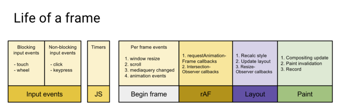

### React Fiber

---

参考：[React技术揭秘](https://react.iamkasong.com/preparation/idea.html)
#### Fiber的诞生

###### 背景

当项目变得庞大、组件数量繁多时，就容易遇到CPU的瓶颈。

考虑如下Demo，我们向视图中渲染3000个li：
```
function App() {
  const len = 3000;
  return (
    <ul>
      {Array(len).fill(0).map((_, i) => <li>{i}</li>)}
    </ul>
  );
}

const rootEl = document.querySelector("#root");
ReactDOM.render(<App/>, rootEl);  
```

主流浏览器刷新频率为60Hz，即每（1000ms / 60Hz）16.6ms浏览器刷新一次。

我们知道，JS可以操作DOM，GUI渲染线程与JS线程是互斥的。所以JS脚本执行和浏览器布局、绘制不能同时执行。

在每16.6ms时间内，需要完成如下工作：



当JS执行时间过长，超出了16.6ms，这次刷新就没有时间执行样式布局和样式绘制了。

在Demo中，由于组件数量繁多（3000个），JS脚本执行时间过长，页面掉帧，造成卡顿。

如何解决这个问题呢？

答案是：在浏览器每一帧的时间中，预留一些时间给JS线程，React利用这部分时间更新组件（可以看到，在[源码](https://github.com/facebook/react/blob/1fb18e22ae66fdb1dc127347e169e73948778e5a/packages/scheduler/src/forks/SchedulerHostConfig.default.js#L119)中预留的初始时间是5ms）。

当预留的时间不够用时，React将线程控制权交还给浏览器使其有时间渲染UI，React则等待下一帧时间到来继续被中断的工作。

**这种将长任务分拆到每一帧中，像蚂蚁搬家一样一次执行一小段任务的操作，被称为时间切片（time slice）**

所以，解决CPU瓶颈的关键是实现时间切片，而时间切片的关键是：将同步的更新变为可中断的异步更新。

###### React15架构
React15架构可以分为两层：
- Reconciler（协调器）—— 负责找出变化的组件
- Renderer（渲染器）—— 负责将变化的组件渲染到页面上

1. Reconciler（协调器）
我们知道，在React中可以通过this.setState、this.forceUpdate、ReactDOM.render等API触发更新。

每当有更新发生时，Reconciler会做如下工作：

- 调用函数组件、或class组件的render方法，将返回的JSX转化为虚拟DOM
- 将虚拟DOM和上次更新时的虚拟DOM对比
- 通过对比找出本次更新中变化的虚拟DOM
- 通知Renderer将变化的虚拟DOM渲染到页面上

2. Renderer（渲染器）
由于React支持跨平台，所以不同平台有不同的Renderer。我们前端最熟悉的是负责在浏览器环境渲染的Renderer -- ReactDOM。

在每次更新发生时，Renderer接到Reconciler通知，将变化的组件渲染在当前宿主环境。

**缺点**

在Reconciler中，mount的组件会调用mountComponent ，update的组件会调用updateComponent 。这两个方法都会递归更新子组件。由于递归执行，所以更新一旦开始，中途就无法中断。当层级很深时，递归更新时间超过了16ms，用户交互就会卡顿。我们称之为 **Stack reconciler**。
###### React16架构
React16架构可以分为三层：
- Scheduler（调度器）—— 调度任务的优先级，高优任务优先进入Reconciler
- Reconciler（协调器）—— 负责找出变化的组件
- Renderer（渲染器）—— 负责将变化的组件渲染到页面上

可以看到，相较于React15，React16中新增了Scheduler（调度器），让我们来了解下他。

1. Scheduler（调度器）
既然我们以浏览器是否有剩余时间作为任务中断的标准，那么我们需要一种机制，当浏览器有剩余时间时通知我们。

其实部分浏览器已经实现了这个API，这就是requestIdleCallback。但是由于以下因素，React放弃使用：

- 浏览器兼容性
- 触发频率不稳定，受很多因素影响。比如当我们的浏览器切换tab后，之前tab注册的requestIdleCallback触发的频率会变得很低

基于以上原因，React实现了功能更完备的requestIdleCallbackpolyfill，这就是Scheduler。除了在空闲时触发回调的功能外，Scheduler还提供了多种调度优先级供任务设置。

```
// requestIdleCallback Polyfill方案
// 很简单，33毫秒，直接固定死每帧的总时间为33ms，还有就是requestAnimationFrame回调的第一个参数，每一帧的起始时间，最终借助requestAnimationFrame让一批扁平的任务恰好控制在一块一块的33ms这样的时间片内执行即可
```

2. Reconciler（协调器）
我们知道，在React15中Reconciler是递归处理虚拟DOM的。让我们看看[React16的Reconciler](https://github.com/facebook/react/blob/1fb18e22ae66fdb1dc127347e169e73948778e5a/packages/react-reconciler/src/ReactFiberWorkLoop.new.js#L1673)。

我们可以看见，更新工作从递归变成了可以中断的循环过程。**每次循环都会调用shouldYield判断当前是否有剩余时间**。

```
/** @noinline */
function workLoopConcurrent() {
  // Perform work until Scheduler asks us to yield
  while (workInProgress !== null && !shouldYield()) {
    workInProgress = performUnitOfWork(workInProgress);
  }
}
```

那么React16是如何解决中断更新时DOM渲染不完全的问题呢？

在React16中，Reconciler与Renderer不再是交替工作。当Scheduler将任务交给Reconciler后，Reconciler会为变化的虚拟DOM打上代表增/删/更新的标记，类似这样：
```
export const Placement = /*             */ 0b0000000000010;
export const Update = /*                */ 0b0000000000100;
export const PlacementAndUpdate = /*    */ 0b0000000000110;
export const Deletion = /*              */ 0b0000000001000;
```
整个Scheduler与Reconciler的工作都在内存中进行。只有当所有组件都完成Reconciler的工作，才会统一交给Renderer。

3. Renderer（渲染器）
Renderer根据Reconciler为虚拟DOM打的标记，同步执行对应的DOM操作。


通过本节我们知道了React16采用新的Reconciler。

Reconciler内部采用了Fiber的架构。

Fiber是什么？他和Reconciler或者说和React之间是什么关系？

#### Fiber是什么？

###### 代数效应与Fiber

Fiber并不是计算机术语中的新名词，他的中文翻译叫做纤程，与进程（Process）、线程（Thread）、协程（Coroutine）同为程序执行过程。

在很多文章中将纤程理解为协程的一种实现。在JS中，协程的实现便是Generator。

所以，我们可以将纤程(Fiber)、协程(Generator)理解为代数效应思想在JS中的体现。

React Fiber可以理解为：

React内部实现的一套状态更新机制。支持任务不同优先级，可中断与恢复，并且恢复后可以复用之前的中间状态。

其中每个任务更新单元为React Element对应的Fiber节点。

###### Fiber的含义

1. 作为架构来说，之前React15的Reconciler采用递归的方式执行，数据保存在递归调用栈中，所以被称为stack Reconciler。React16的Reconciler基于Fiber节点实现，被称为Fiber Reconciler。

2. 作为静态的数据结构来说，每个Fiber节点对应一个React element，保存了该组件的类型（函数组件/类组件/原生组件...）、对应的DOM节点等信息。

3. 作为动态的工作单元来说，每个Fiber节点保存了本次更新中该组件改变的状态、要执行的工作（需要被删除/被插入页面中/被更新...）。

###### Fiber的结构

你可以从这里看到[Fiber节点的属性定义](https://github.com/facebook/react/blob/1fb18e22ae66fdb1dc127347e169e73948778e5a/packages/react-reconciler/src/ReactFiber.new.js#L117)。虽然属性很多，但我们可以按三层含义将他们分类来看

```
function FiberNode(
  tag: WorkTag,
  pendingProps: mixed,
  key: null | string,
  mode: TypeOfMode,
) {
  // 作为静态数据结构的属性
  this.tag = tag;
  this.key = key;
  this.elementType = null;
  this.type = null;
  this.stateNode = null;

  // 用于连接其他Fiber节点形成Fiber树
  this.return = null;
  this.child = null;
  this.sibling = null;
  this.index = 0;

  this.ref = null;

  // 作为动态的工作单元的属性
  this.pendingProps = pendingProps;
  this.memoizedProps = null;
  this.updateQueue = null;
  this.memoizedState = null;
  this.dependencies = null;

  this.mode = mode;

  this.effectTag = NoEffect;
  this.nextEffect = null;

  this.firstEffect = null;
  this.lastEffect = null;

  // 调度优先级相关
  this.lanes = NoLanes;
  this.childLanes = NoLanes;

  // 指向该fiber在另一次更新时对应的fiber
  this.alternate = null;
}
```

每个Fiber节点有个对应的React element，多个Fiber节点是如何连接形成树呢？靠如下三个属性：
```
// 指向父级Fiber节点
this.return = null;
// 指向子Fiber节点
this.child = null;
// 指向右边第一个兄弟Fiber节点
this.sibling = null;
```


###### 双缓存Fiber树

在React中最多会同时存在两棵Fiber树。当前屏幕上显示内容对应的Fiber树称为current Fiber树，正在内存中构建的Fiber树称为workInProgress Fiber树。

每次状态更新都会产生新的workInProgress Fiber树，通过current与workInProgress的替换，完成DOM更新。


