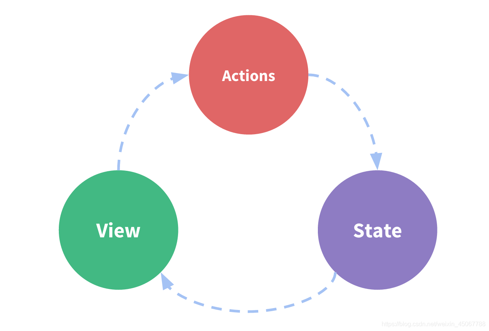
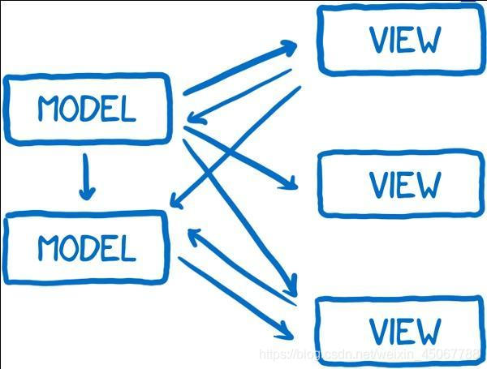

### 状态管理

---

### 单向数据流是什么？

单向数据流（Unidirectional data flow）方式使用一个上传数据流和一个下传数据流进行双向数据通信，两个数据流之间相互独立。单向数据流指只能从一个方向来修改状态。下图是单向数据流的极简示意：



- actions：响应在 view 上的用户输入导致的状态变化
- state：驱动应用的数据源
- view：以声明方式将 state 映射到视图

与单向数据流对对应的是双向数据流（也叫双向绑定）。在双向数据流中，Model（可以理解为状态的集合） 中可以修改自己或其他Model的状态， 用户的操作（如在输入框中输入内容）也可以修改状态。**这使改变一个状态有可能会触发一连串的状态的变化，最后很难预测最终的状态是什么样的**。使得代码变得很难调试。如下图所示：



与双向数据流比，在单向数据流中，当你需要修改状态，完全重新开始走一个修改的流程。这限制了状态修改的方式，让状态变得可预测，容易调试。

**单向数据流的使用场景**

多个组件会共享状态时，共享状态和组件间（兄弟组件）通信变的不容易。我们把共享状态抽取出来，用单向数据流的方式会变得容易。

**react和vue都是单向数据流框架**，规范了数据的流向——由外层组件向内层组件进行传递和更新。 

**双向数据流的使用场景**

无论数据改变，或是用户操作，都能带来互相的变动，自动更新。适用于项目细节，如：UI控件中(通常是类表单操作)。

#### vuex和redux解决什么问题？

虽然vue和react框架本身有自己状态管理，当我们的应用遇到多个组件共享状态时，**单向数据流的简洁性很容易被破坏**：

- 多个视图依赖于同一状态
- 来自不同视图的行为需要变更同一状态

对于问题一，传参的方法对于多层嵌套的组件将会非常繁琐，并且对于兄弟组件间的状态传递无能为力。
对于问题二，我们经常会采用父子组件直接引用或者通过事件来变更和同步状态的多份拷贝。以上的这些模式非常脆弱，通常会导致无法维护的代码。

因此，我们为什么不把组件的共享状态抽取出来，以一个全局单例模式管理呢？在这种模式下，我们的组件树构成了一个巨大的“视图”，不管在树的哪个位置，任何组件都能获取状态或者触发行为！

另外，通过定义和隔离状态管理中的各种概念并强制遵守一定的规则，我们的代码将会变得更结构化且易维护。

1. 所有状态的改变可记录、可跟踪，源头易追溯;
2. 所有数据只有一份，组件数据只有唯一的入口和出口，使得程序更直观更容易理解，有利于应用的可维护性;
3. 一旦数据变化，就去更新页面(data-页面)，但是没有(页面-data);
4. 如果用户在页面上做了变动，那么就手动收集起来(双向是自动)，合并到原有的数据中。

#### Mobx

MobX 是一个经过战火洗礼的库，它通过透明的函数响应式编程(transparently applying functional reactive programming - TFRP)使得状态管理变得简单和可扩展。MobX背后的哲学很简单:

任何源自应用状态的东西都应该自动地获得。

其中包括UI、数据序列化、服务器通讯，等等。


React 和 MobX 是一对强力组合。React 通过提供机制把应用状态转换为可渲染组件树并对其进行渲染。而MobX提供机制来存储和更新应用状态供 React 使用。

Mobx 使用了 **Object.defineProperty 拦截 getter 和 setter**，但是无法拦截未定义的变量。

1. 定义状态并使其可观察

可以用任何你喜欢的数据结构来存储状态，如对象、数组、类。 循环数据结构、引用，都没有关系。 只要确保所有会随时间流逝而改变的属性打上 mobx 的标记使它们变得可观察即可。

```
import {observable} from 'mobx';

let appState = observable({
    timer: 0
});
```
2. 创建视图以响应状态的变化

```
import {observer} from 'mobx-react';

let App = observer(({ appState }) => {
    return (
        <div className="App">
            <h1>Time passed: {appState.timer}</h1>
        </div>
    );
});
```

3. 更改状态

```
import { action } from "mobx";

setInterval(action(()=>{
  appState.timer +=1  
}), 1000) 
```

###### Redux vs Mobx
那么具体到这两种模型，又有一些特定的优缺点呈现出来，先谈谈 Redux 的优势：

- 数据流流动很自然，因为任何 dispatch 都会导致广播，需要依据对象引用是否变化来控制更新粒度。
- 如果充分利用时间回溯的特征，可以增强业务的可预测性与错误定位能力。
- 时间回溯代价很高，因为每次都要更新引用，除非增加代码复杂度，或使用 immutable。
- 时间回溯的另一个代价是 action 与 reducer 完全脱节，数据流过程需要自行脑补。原因是可回溯必然不能保证引用关系。
- 引入中间件，其实主要为了解决异步带来的副作用，业务逻辑或多或少参杂着 magic。
- 但是灵活利用中间件，可以通过约定完成许多复杂的工作。
- 对 typescript 支持困难。

Mobx：

- 数据流流动不自然，只有用到的数据才会引发绑定，局部精确更新，但免去了粒度控制烦恼。
- 没有时间回溯能力，因为数据只有一份引用。
- 自始至终一份引用，不需要 immutable，也没有复制对象的额外开销。
- 没有这样的烦恼，数据流动由函数调用一气呵成，便于调试。
- 业务开发不是脑力活，而是体力活，少一些 magic，多一些效率。
- 由于没有 magic，所以没有中间件机制，没法通过 magic 加快工作效率（这里 magic 是指 action 分发到 reducer 的过程）。
- 完美支持 typescript。
